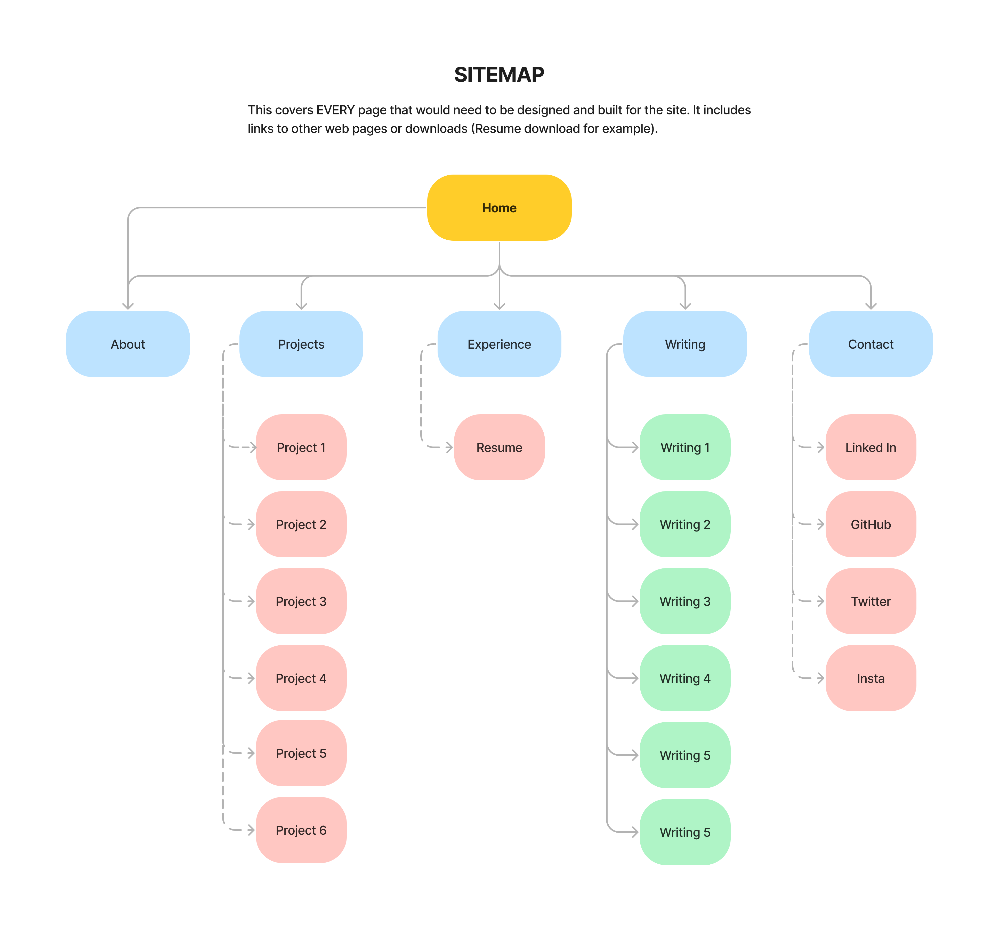

# T1A2 Portfolio - Jordan Benjamin

## Overview

Welcome to my portfolio website, this is my first attempt in creating a website of any kind and here I will guide you through a high level overview of how the site was created! Thank you and enjoy 😄

- [Netlify site](https://jordansbenjamin.netlify.app/)

- [Github Repository](https://github.com/jordansbenjamin/Portfolio_T1A2)

- Presentation clip (Provided to CoderAcademy)

---
## Purpose

The portfolio website was created to showcase a variety of skills as web developer or IT professional, they include the following:

- Writing readable but most importnatly syntactically and semantically valid HTML.
- Creating a responsive website with three different device layouts.
- The use of core CSS layout concepts such as flexbox and/or grid to create responsive site elements.

The skills used to create the website will demonstate web development abilities to present potential clients or employers. They will find a fully functional and responsive website.

---
## Target Audience

The main focus for target audience are potential clients of small business who are looking to have a website or web app created or upgrade an exisiting one. But more importantly, the prospect of potential employers who are seeking for a junior web developer to come on board their team or company are also catered towards.

On a side note, this website all offers interest to web developers or programmers who have an interest in finding a collaborator to help solve complex technical or design problems together. 

---
## Functionality & Features
Both the design and technical features of the website are integrated as seamlessly as possible for the best possible user experience. 

### Design

The design for the website has an emphasis in simplicity and subtlety in its overall design use, but more importantly the use of colours and typography being the main focus.

#### Typography

- The use of typography has a clear dominance that adds to the style and design of the website, each page has a large title that draws the user in. 
#### Layout

- The website itself is simple in its layout, an important part of the layout is the way text is set. Always starting from the left hand of the screen as the natural reading pattern of most humans start from left to right. This creates a seamless and effortless experience when reading text on the website

#### Color

- The use of colour is also emphasized except that the colours are merely monotone and contrast each other really nicely. The use of a light cream borderline beige alongside the darker soft almost brown blacks creates a pleasing colour pallette for the visitors of the site. But more importantly, it's entirely accessible. 

### Navigation

There are two different navigation options for visitors of the site:

#### Desktop navigation

- The main navigation is the desktop version, which includes a simple navigation with links to different pages on top of the page. 

#### Mobile navigation

- The second type of navigation is the hamburger menu navigation which is only activated when a certain screen size meets its criteria, this screen size is specifically for tablet and mobile screens. The main feature of the hamburger menu includes a sliding navigation drawer with links to the different pages. 

### Animations

Simple animations are used throughout the website, and increases functionality or adds to design. 

#### Background

- The background element itself is animated, it's animated to add a subtle static noise that adds texture to the website and huge component in design choice. 

#### Cards
- Cards that presents projects and blog posts are animated to increase user engagement when hovering and interacting with each individual card element.
- One card lifts up, while the other presses in to give a different effect when interacting.
- Each card element also have a text overlay with a subtle colour overlay to make the text stand out further when hovering.
#### Buttons

- Buttons are animated to increase interactive functionality to engage the visitor of the site, it's subtle but used throughout the website enough that it's character and is apart of the design.

---
## Tech Stack

- HTML5
- CSS3 / SCSS
- JavaScript
- GitHub
- Netlify
- Figma

---

## Sitemap

    

---

## Wireframes

---
## Screenshots of deployed site

